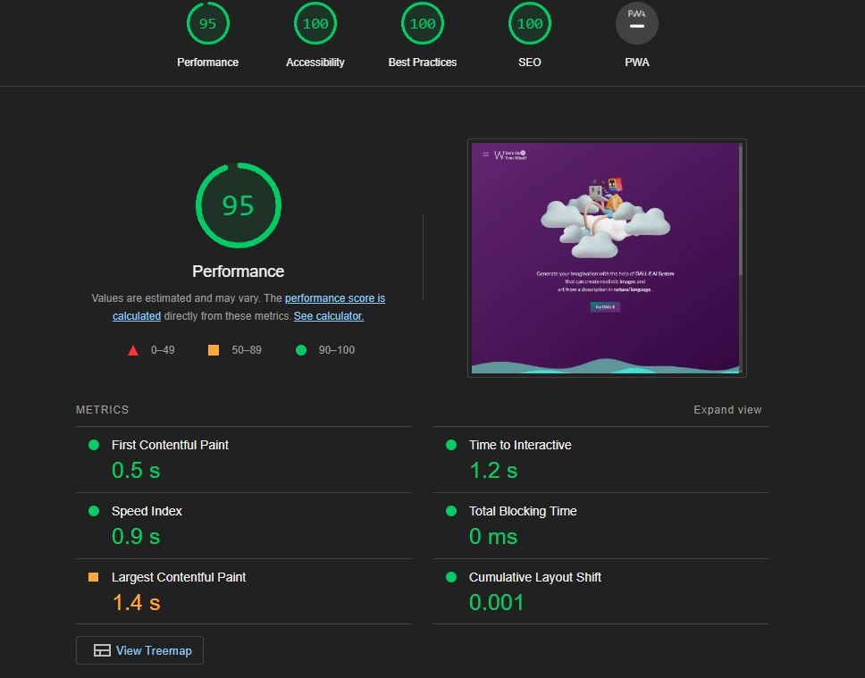
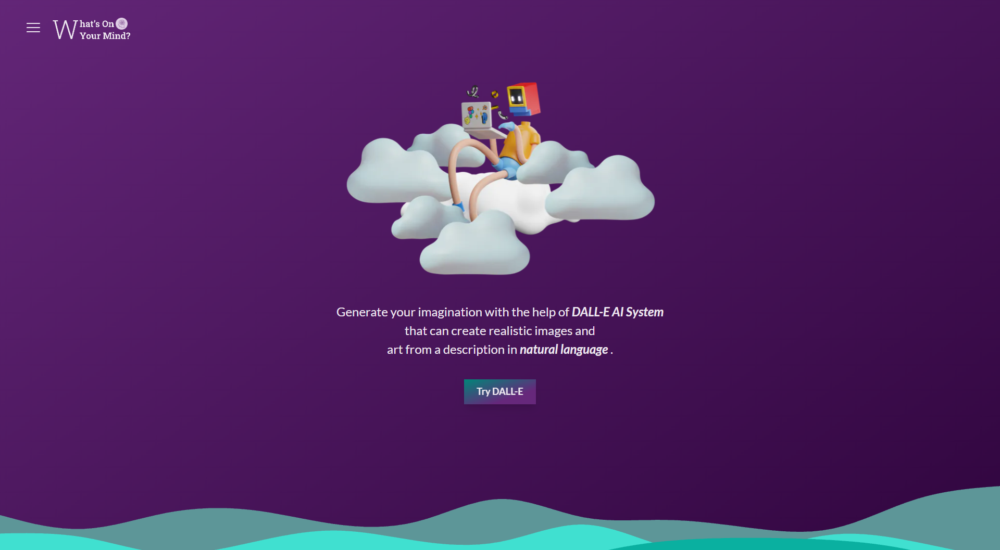
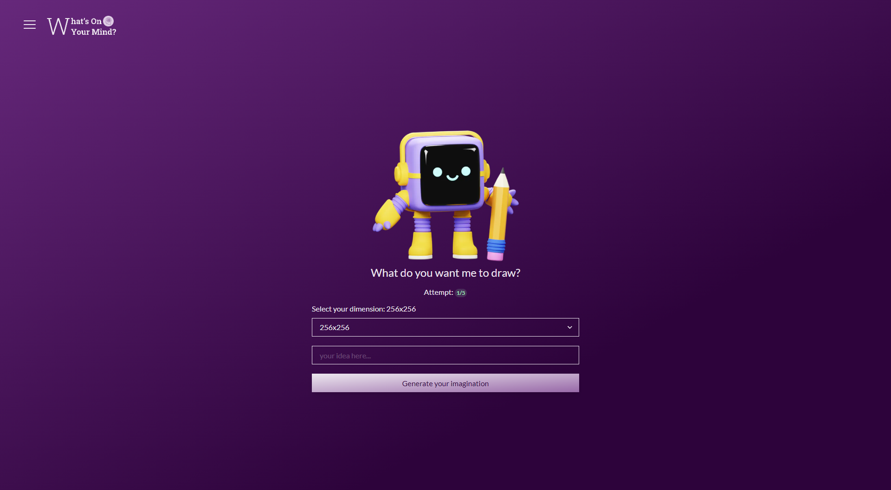
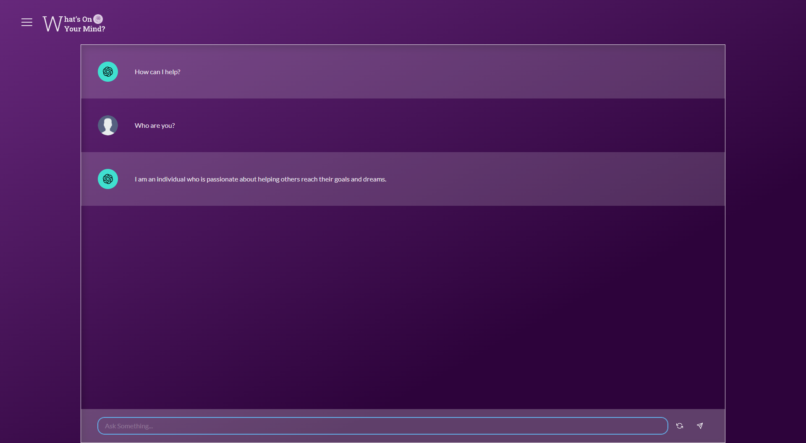

# What's On Your Mind?.
A Simple NextJS web app which is provided image generation and text completion by OpenAI (DALL-E 2 and ChatGPT).

# Major Technologies
- ### [NextJS](https://nextjs.org/)
- ### [Dall-E 2](https://openai.com/product/dall-e-2)
- ### [GPT-3](https://openai.com/product)
- ### [ChakraUI](https://chakra-ui.com/)

# Overall Performance

# Preview Pages
**Home Page**

**Dall-E Page**

**CHATGPT Page**

***Design*** - [Go to Figma](https://www.figma.com/file/wBQzIq98BEM0WEpH99vdl2/What's-on-your-mind%3F?t=dZfoToYn5Gv7SkiR-1) 

***Live Demo*** - https://whats-on-your-mind.vercel.app/

# Reference Assets
- https://iconscout.com/3d-pack/cube-robot
- https://www.flaticon.com/free-icon/artificial-intelligence_9594599?related_id=9594599
- https://iconscout.com/3ds/cloud
- https://www.figma.com/file/qnZNMDi06LZuKe3OBNxgax/SALY---3D-Illustration-Pack-(Community)